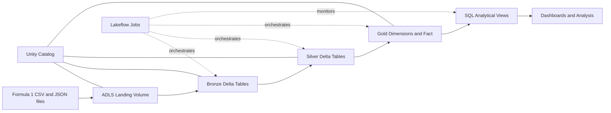
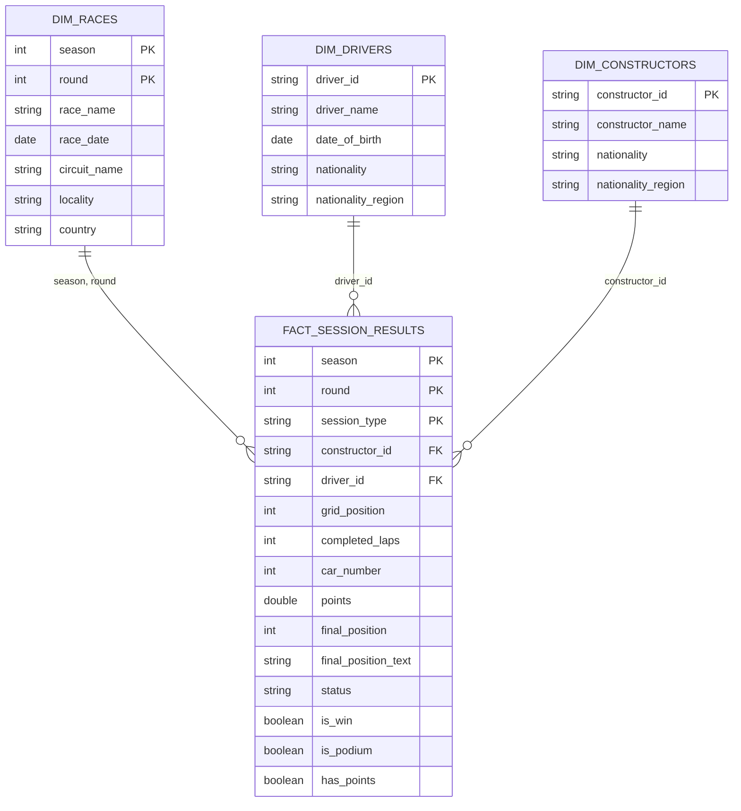
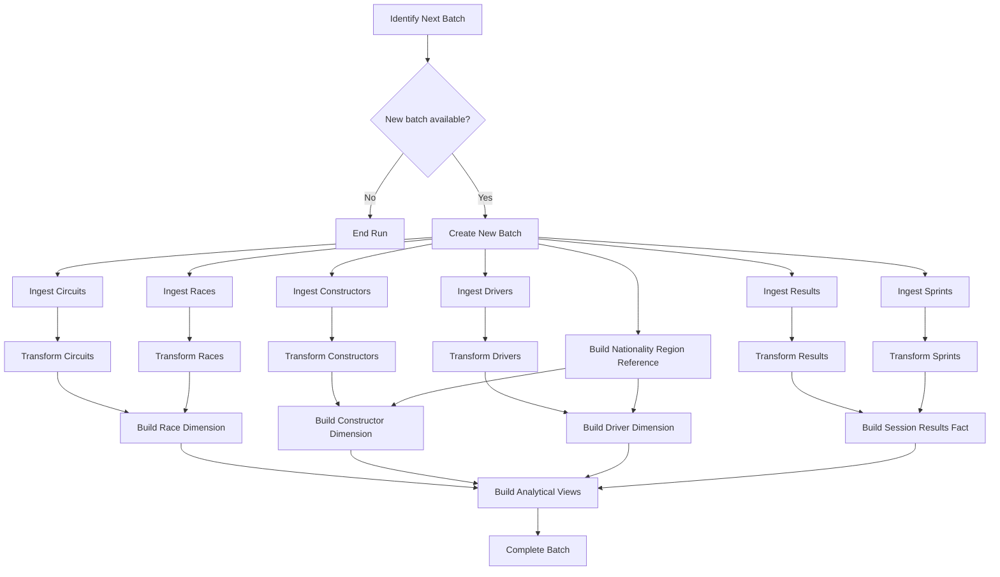
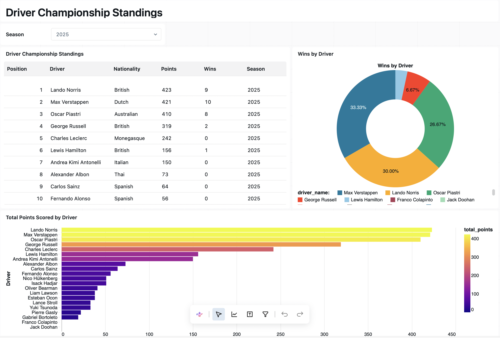
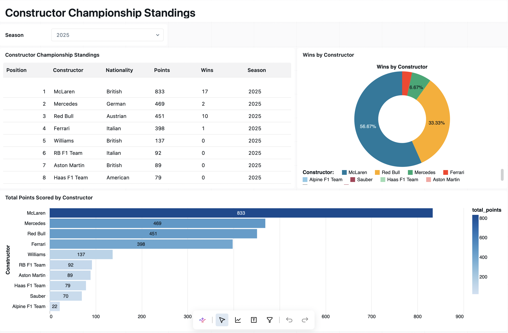

# Formula 1 Data Lakehouse on Azure Databricks

This repository contains a hands-on batch data engineering project that builds a Formula 1 data lakehouse on Azure Databricks.

The project demonstrates how raw CSV and JSON files can be ingested from Azure Data Lake Storage, processed through Bronze, Silver, and Gold layers, stored as Delta tables, modelled for analytics, and orchestrated as an incremental pipeline with Lakeflow Jobs.

Two implementations are included:

- **Full-load pipeline** — builds the complete lakehouse by processing all available source data.
- **Incremental-load pipeline** — processes one new batch at a time and uses Delta `MERGE` operations to update existing tables safely.

---

## Project Objectives

The project was built to practise the end-to-end responsibilities of a data engineer in Azure Databricks:

- Configure governed access from Databricks to Azure Data Lake Storage.
- Organize data using Unity Catalog catalogs, schemas, tables, and volumes.
- Ingest multiple file formats with explicit Spark schemas.
- Add ingestion metadata for traceability and auditing.
- Apply data-quality and standardization rules with PySpark.
- Store reliable, versioned datasets using Delta Lake.
- Build a dimensional Gold model for reporting and analytics.
- Create driver and constructor standings with Spark SQL.
- Orchestrate dependencies, parameters, retries, and batch status with Lakeflow Jobs.
- Extend a full-refresh pipeline into an incremental and rerunnable batch pipeline.

---

## Technology Stack

| Area | Technology |
|---|---|
| Cloud platform | Microsoft Azure |
| Processing platform | Azure Databricks |
| Distributed processing | Apache Spark / PySpark |
| Query language | Spark SQL |
| Storage | Azure Data Lake Storage Gen2 |
| Table format | Delta Lake |
| Governance | Unity Catalog |
| Orchestration | Databricks Lakeflow Jobs |
| Development | Databricks notebooks |

---

## Source Datasets

The pipeline processes six Formula 1 datasets:

| Dataset | Format | Description |
|---|---|---|
| `circuits` | CSV | Circuit names and geographical information |
| `races` | CSV | Season, round, race date, and circuit references |
| `constructors` | JSON | Constructor names and nationalities |
| `drivers` | JSON | Driver names, dates of birth, and nationalities |
| `results` | JSON | Formula 1 race results |
| `sprints` | JSON | Formula 1 sprint results |

---

## Architecture



The data lakehouse follows the Medallion Architecture:

### Landing

The Landing layer is the controlled entry point for the original files. Files remain in their source format and are accessed through a Unity Catalog external volume.

### Bronze

The Bronze layer stores source-aligned Delta tables with minimal transformation.

Key operations include:

- Reading CSV and JSON files with explicit schemas.
- Using `FAILFAST` mode to detect malformed data.
- Adding `ingestion_timestamp` and `source_file` audit columns.
- Adding `batch_id` in the incremental implementation.
- Partitioning incremental Bronze tables by `batch_id`.

### Silver

The Silver layer contains cleaned and standardized records that preserve the business keys required by downstream models.

Typical transformations include:

- Converting column names to snake case.
- Dropping columns that are not required for analytics.
- Flattening nested JSON structures.
- Standardizing text values and date fields.
- Filtering records with missing business keys.
- Removing duplicates.
- Adding `created_timestamp` and `updated_timestamp`.

### Gold

The Gold layer uses a dimensional model that is optimized for analytical queries.

It contains:

- `dim_races`
- `dim_drivers`
- `dim_constructors`
- `fact_session_results`
- `ref_nationality_region`

Race and sprint records are combined into a single fact table by adding a `session_type` column with either `RACE` or `SPRINT`.

The fact table also derives reusable business indicators:

- `is_win`
- `is_podium`
- `has_points`

---

## Gold Data Model



This model allows reporting queries to aggregate measures from the fact table while filtering and grouping by descriptive attributes from the dimensions.

---

## Full-Load Pipeline

The first implementation demonstrates the complete flow before incremental processing is introduced.

```text
Landing files
    ↓
Bronze ingestion notebooks
    ↓
Silver transformation notebooks
    ↓
Gold dimensional-model notebooks
    ↓
Driver and constructor standings views
```

Each Bronze table is initially written with an overwrite operation. The Silver and Gold layers are then rebuilt from the complete Bronze dataset.


---

## Incremental-Load Pipeline

The second implementation extends the project so that only the next unprocessed batch is handled during each run.

Landing data is organized by batch folder:

```text
landing/
├── 2025-01/
│   ├── circuits.csv
│   ├── races.csv
│   ├── constructors.json
│   ├── drivers.json
│   ├── results.json
│   └── sprints.json
└── 2025-02/
    └── ...
```

### Batch Control

A Delta control table tracks pipeline progress:

```text
formula1_incr.control.batch_control
```

| Column | Purpose |
|---|---|
| `batch_id` | Identifies the landing batch |
| `status` | Stores `in_progress` or `completed` |
| `created_timestamp` | Records when processing began |
| `updated_timestamp` | Records the latest status update |

The orchestration notebooks perform the following sequence:

1. List batch folders in the landing volume.
2. Read batches already registered in the control table.
3. Select the earliest unprocessed batch.
4. Pass its ID to downstream tasks with Lakeflow task values.
5. Mark the batch as `in_progress`.
6. Run Bronze, Silver, and Gold processing for that batch.
7. Mark the batch as `completed` after successful processing.

### Incremental Write Strategy

#### Bronze

Bronze tables are partitioned by `batch_id`. The write uses `replaceWhere` so that rerunning one batch replaces only that partition rather than overwriting the entire table.

```python
(
    dataframe.write
        .format("delta")
        .mode("overwrite")
        .partitionBy("batch_id")
        .option("replaceWhere", f"batch_id = '{batch_id}'")
        .saveAsTable(target_table)
)
```

#### Silver

Silver tables use Delta `MERGE` based on each dataset's business key.

- Existing records are updated when the incoming batch is the same as or newer than the stored batch.
- New business keys are inserted.
- `created_timestamp` remains unchanged during an update.
- `updated_timestamp` records the latest modification.
- Older batches cannot overwrite records produced from newer batches.

#### Gold

Gold dimensions and the fact table also use Delta `MERGE`. This makes the analytical model rerunnable while avoiding a complete rebuild during each batch.

---

## Lakeflow Jobs Orchestration

Lakeflow Jobs is used to turn the individual notebooks into a coordinated production workflow. It manages task order and dependencies, passes the current batch between notebooks, and provides a central place to run, monitor, retry, and schedule the pipeline.

The incremental workflow follows this logical task graph:



### Passing the Batch ID Between Tasks

The first orchestration notebook examines the landing folders and the `batch_control` table to identify the earliest unprocessed batch. It then publishes two Lakeflow task values:

```python
if next_batch is None:
    dbutils.jobs.taskValues.set(key="p_batch_id", value="")
    dbutils.jobs.taskValues.set(key="has_batch", value="false")
else:
    dbutils.jobs.taskValues.set(key="p_batch_id", value=next_batch)
    dbutils.jobs.taskValues.set(key="has_batch", value="true")
```

The value of `p_batch_id` is mapped to a notebook parameter for downstream tasks. Each notebook reads it through a Databricks widget:

```python
dbutils.widgets.text("p_batch_id", "")
batch_id = dbutils.widgets.get("p_batch_id")
```

This allows every Bronze, Silver, and Gold task in the same job run to process the same batch without hard-coding its identifier.

---

## Analytical Views

The project creates two Spark SQL views.



`v_driver_standing` calculates each driver's seasonal performance using:

- Race or session starts
- Total points
- Number of wins
- Number of podiums
- Seasonal standing calculated with `RANK()`



`v_constructor_standing` calculates each constructor's seasonal performance using the same measures and ranking logic.

These views support questions such as:

- How did each driver perform during a season?
- How did each constructor perform during a season?
- Which drivers accumulated the most wins and podiums?
- Which constructors achieved the strongest long-term results?

---

## Repository Structure

```text
.
├── formula1-project/
│   ├── 00-common/          # Shared configuration and Bronze helper functions
│   ├── 01-setup/           # Unity Catalog and project environment setup
│   ├── 02-bronze/          # Full-load ingestion notebooks
│   ├── 03-silver/          # Cleaning and standardization notebooks
│   ├── 04-gold/            # Dimensions, reference data, and fact table
│   └── 05-analytics/       # Driver and constructor SQL views
│
└── formula1-project-incremental-load/
    ├── 00-common/          # Environment and reusable Delta write helpers
    ├── 01-setup/           # Incremental catalog and storage setup
    ├── 02-bronze/          # Batch-parameterized ingestion notebooks
    ├── 03-silver/          # Batch filtering and Silver MERGE logic
    ├── 04-gold/            # Incremental dimensions and fact table
    ├── 05-analytics/       # Analytical SQL views
    └── 06-orchestration/   # Batch control and task-value notebooks
```

---

## What I Learned

Through this project, I learned how the main components of Azure Databricks work together in an end-to-end data engineering workflow.

In particular, I gained hands-on experience with:

- Designing a multi-layer lakehouse with the Medallion Architecture.
- Connecting Databricks and ADLS through Unity Catalog-managed credentials and external locations.
- Choosing between volumes, schemas, managed locations, and Delta tables.
- Building reusable PySpark ingestion and transformation patterns.
- Using Delta Lake transaction logs, ACID guarantees, version history, and `MERGE` operations.
- Modelling facts and dimensions for efficient analytical queries.
- Using Spark SQL joins, aggregations, conditional counts, CTEs, and window functions.
- Passing parameters between Lakeflow Job tasks.
- Designing a batch control mechanism that supports incremental processing.

---

## Potential Improvements

Possible next steps include:

- Define the Lakeflow Job as code using Databricks Asset Bundles.
- Add automated data-quality tests and pipeline assertions.
- Add data-volume and freshness monitoring.
- Add a CI/CD workflow for notebook deployment.

